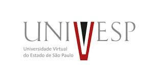

# Tópicos Avançados em Engenharia de Computação I

Esse é o repositório referente a disciplina Tópicos Avançados em Engenharia de Computação I do programa de facilitadores da UNIVESP do ano de 2021.

Nele você encontrará os pequenos resumos de cada semana da disciplina junto com notebooks em python, onde terá exercícios resolvidos. O repositório será atualizado semanalmente.

## Como abrir

- Abra as versões executaveis dos notebooks usando [Google Colab](http://colab.research.google.com): 

## Conteúdo

### [1. Semana 1](https://colab.research.google.com/github/CPKrebs/UNIVESP-TAE301/blob/main/Semana1.ipynb)
### [2. Semana 2](https://colab.research.google.com/github/CPKrebs/UNIVESP-TAE301/blob/main/Semana2.ipynb)
### [3. Semana 3](https://colab.research.google.com/github/CPKrebs/UNIVESP-TAE301/blob/main/Semana2.ipynb)

